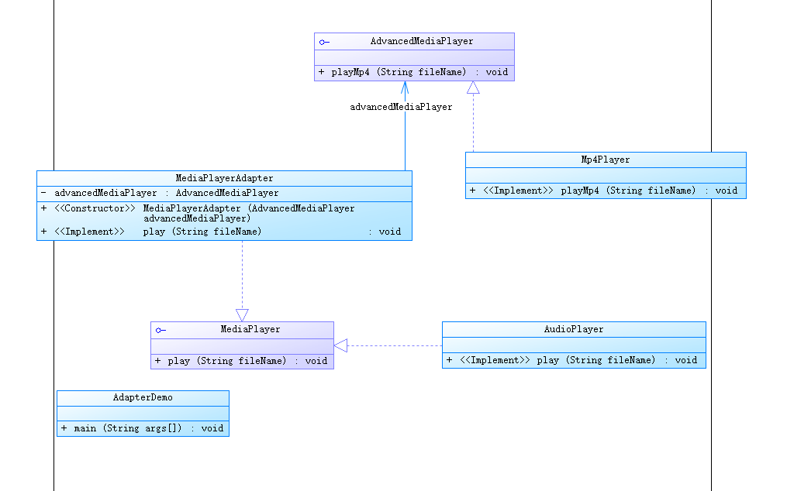

# 适配器模式

1. 意图：使由于接口不兼容而不能一起工作的类在一起工作。

2. 何时使用：系统使用现在有类，而类的接口又不满足需求；通过接口转换，将一个类插入到另一个类使用。

3. 优点： 1、可以让任何两个没有关联的类一起运行。 2、提高了类的复用。 3、增加了类的透明度。 4、灵活性好。

   4. 缺点： 1、过多地使用适配器，会让系统非常零乱，不易整体进行把握。

   实现：

   1、原来的需求AudioPlayer 类play 只能播放mp3,新需求是要播放mp4.

   2、新增AdvancedMediaPlayer 接口，实现类为Mp4player 。

   3、新增MediaPlayerAdapter 适配器实现旧的接口，增加成员变量AdvancedMediaPlayer ，实现方法play 则实际是执行AdvancedMediaPlayer.playMp4

### 源码应用

. spring mvc ,WebMvcConfigurerAdapter，HandlerAdapter