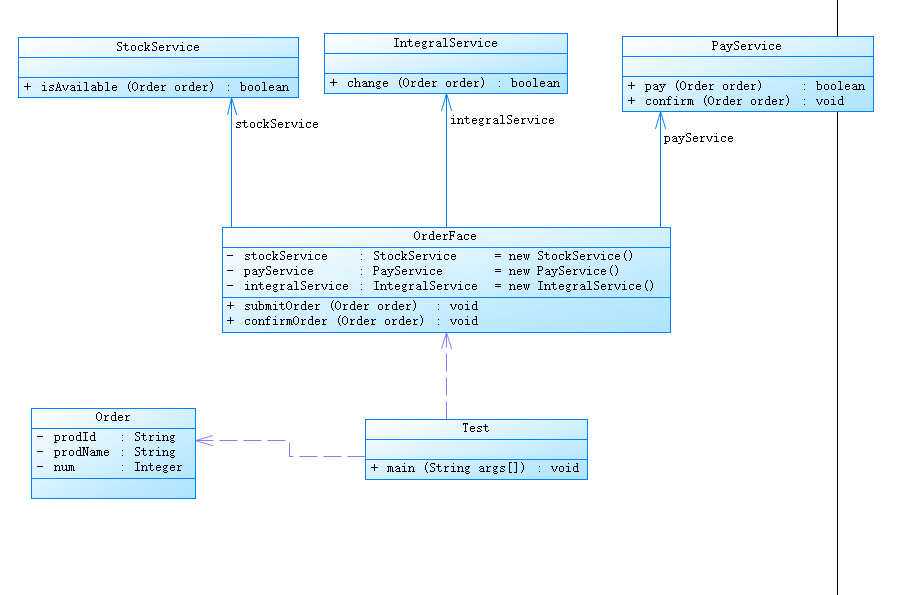

# 外观模式

1. 定义：又称门面模式。提供一个统一的接口，用于访问各个子系统中的一群接口，定义一个高层的接口，让子系统更容易使用

2. 主要解决：降低访问复杂系统的内部子系统时的复杂度，简化客户端与之的接口。

3. 何时使用：客户端无需关心系统内部复杂关系，系统只提供一个统一的接口。

4. 优点：简化调用过程，减少系统依赖、松散耦合，更好

5. 缺点：增加子系统 增加风险，不符合开闭原则，如果要改东西很麻烦，继承重写都不合适

6. 需求：客户提交订单时，涉及到库存校验，积分变更，支付这个操作，客户只关心提交订单这个动作。我们可以定义一个统一的接口类，让客户端调用。这个接口实现类把库存校验，积分变更，支付这些操作统一处理好。

   
