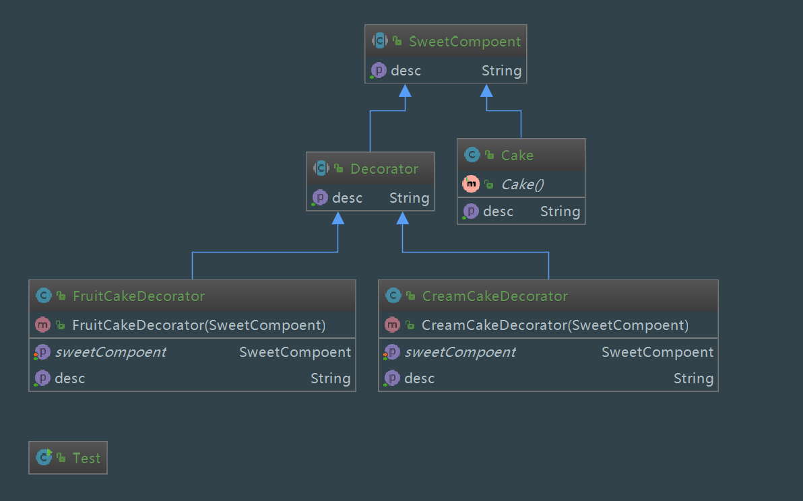

装饰者模式

1. 定义：动态地给一个对象增加一些额外的职责(功能)，比生成子类更加灵活。

2. 主要解决：我们为了扩展一个类经常使用继承方式实现，由于继承为类引入静态特征，并且随着扩展功能的增多，子类会很膨胀。

3. 何时使用：在不想增加很多子类的情况下扩展类。

4. 优点：装饰类和被装饰类可以独立发展，不会相互耦合，装饰模式是继承的一个替代模式，装饰模式可以动态扩展一个实现类的功能。

5. 缺点：多层装饰比较复杂。

6. 需求：我们将把一个形状装饰上不同的颜色，同时又不改变形状类。

7. 角色

  . 抽象组件类: 装饰者和被装饰者共同的父类，是一个接口或者抽象类，用来定义基本行为

  . 具体组件类(被装饰类)：继承或实现抽象组件类，也可以动态增加功能

  . 抽象装饰类: 继承抽象组件类

  . 具体装饰类

