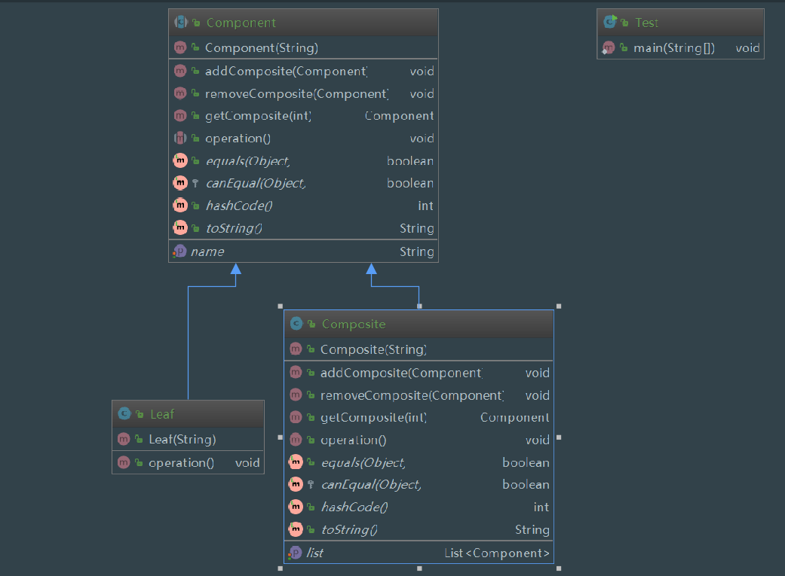

组合模式

1. 定义：将对象组合成树形结构以表示"部分-整体"的层次结构。组合模式使得用户对单个对象和组合对象的使用具有一致性。

2. 主要解决：它在我们树型结构的问题中，模糊了简单元素和复杂元素的概念，客户程序可以像处理简单元素一样来处理复杂元素，从而使得客户程序与复杂元素的内部结构解耦。

3. 何时使用：1、您想表示对象的部分-整体层次结构（树形结构）。 2、您希望用户忽略组合对象与单个对象的不同，用户将统一地使用组合结构中的所有对象。

4. 优点：1、高层模块调用简单。 2、节点自由增加。

5. 缺点：多层装饰比较复杂。

6. 需求：部分、整体场景，如树形菜单，文件、文件夹的管理。

7. 角色

  component (抽象构件：容器)：它可以是接口或者抽象类，为叶子构建和子容器构建对象声明接口，在该角色中可以包含所有子类共有的行为的实现和声明。在抽象构建中定义了访问及管理它的子构件的方法，如增加子构件，删除子构件，获取子构件等。
  
  leaf(叶子构建)：叶子构建可以说就是各种类型的文件！叶子构建没有子构件。它实现了抽象构建中的定义的行为。对于那些访问子容器，删除子容器，增加子容器的就报错。
  
  compsite(子容器构建)：它在组合模式中表示容器节点对象，容器结点是子节点，可以是子容器，也可以是叶子构建，它提供一个集合来存储子节点。
  

